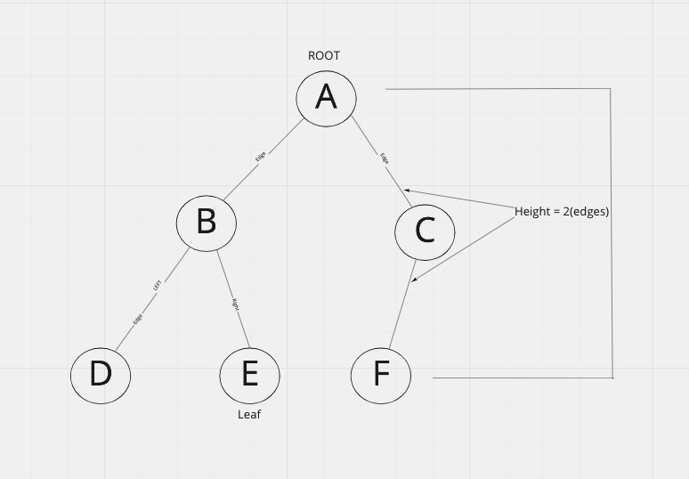

# Trees

[Trees](https://codefellows.github.io/common_curriculum/data_structures_and_algorithms/Code_401/class-15/resources/Trees.html)

A node based data structure where each node can point to multiple nodes.

- Root: base node
- K: number of children that any node MAY have
- Left: reference to one child node in a binary tree
- Right: reference to one child node in a binary tree
- Edge: Link between nodes
- Leaf: Node with no children
- Height: Number of edges from root to furthest leaf

## Traversal Methods

### Depth First

- Stack

Traversed with recursion. The call stack is loaded with the value of a root node, and then it's children.  Traverses tree down while loading the call stack with function calls on each node.

- pre-order [ A, B, D, E, C, F ]

- in-order [ D, B, E, A, F, C ]

- post-order [ D, E, B, F, C, A]

### Breadth First

- Queue

output = [ A, B, C, D, E, F]

Nodes are added to a queue in left/right order.
Root Node in Queue.          [       A]
A loads links to B and C.    [    C, B]
B loads links to D and E.    [ E, D, C]
C loads link to F.           [F, E, D ]

### Binary Search Tree k=2

Higher numbers to the right\
Fast traversal similar to binary search.
